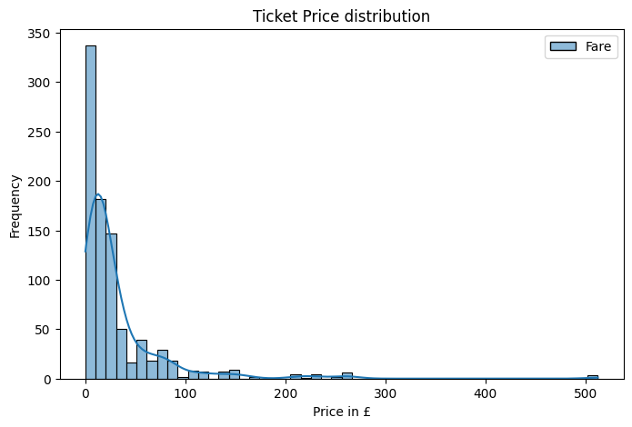
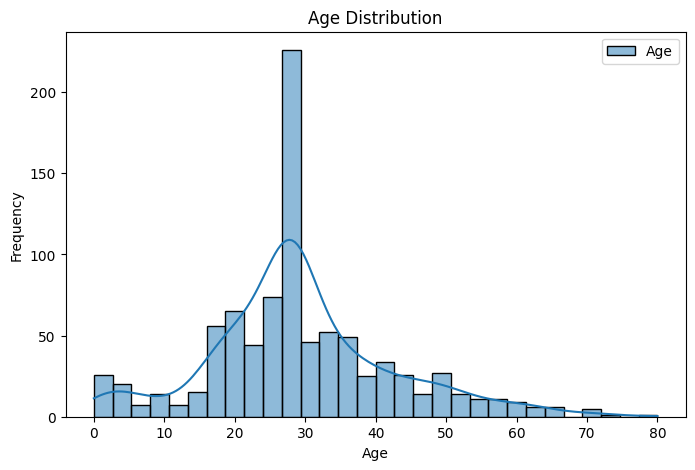
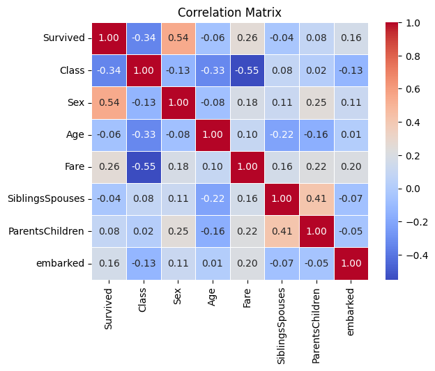
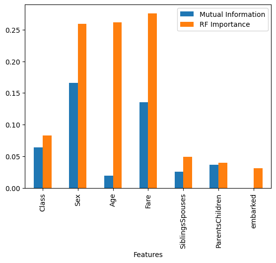

# Titanic Data Wrangling & EDA Project
Homework #3: Collaborative Data Wrangling & EDA 
DSE 511 - Fall 2025

## Dataset Information

**Source:** [Titanic dataset from Seaborn](https://github.com/mwaskom/seaborn-data/blob/master/titanic.csv)
**Date Accessed:** September 5, 2025
**Size:** 55.7 kb, 892 rows

## Methods
### Data Cleaning (Cooper)

**Steps taken to clean the dataset:**

1. Inspected the dataset to determine what varaibles had missing values
2. Since majority of the varaible Deck had missing values I decided to remove the variable
3. Filled the 2 missing values from the variable Embarked with the mode of the values
4. Used random distribution to fill the missing values for age
5. Standarized the variable Sex with 'M' and 'F' values
6. Cleaned and chose the variables useful for analysis

**Variables:**

| Column            | Description |
|------------------|-------------|
| Survived          | Survival status (0 = No, 1 = Yes) |
| Class             | Passenger class (1 = 1st, 2 = 2nd, 3 = 3rd) |
| Sex               | Gender (M/F) |
| Age               | Age in years (missing values filled via random imputation + median) |
| SiblingsSpouses   | Number of siblings/spouses aboard |
| ParentsChildren   | Number of parents/children aboard |
| Fare              | Passenger fare |

**Tools/libraries used:** 

numpy was utilized for the random distribution to fill the values in the varible Age
pandas was utilized for data manipulation
seaborn and matplotlib were used for data vizualisation
sklearn was used to compute PCA, mutual information, and random forest


### Exploratory Data Analsis (Amine)
**Ticket classes distribution:** 
Class 1: 216
Class 2: 184
Class 3: 491

|       | Price (1912) | Adjusted Price (2025, inflation-adjusted) |
|-------|--------------|-------------------------------------------|
| mean  | 32.20        | 1052.216696                               |
| std   | 49.69        | 1623.646677                               |
| min   | 0            | 0                                         |
| 25%   | 7.91         | 258.46                                    |
| 50%   | 14.45        | 472.26                                    |
| 75%   | 31           | 1012.87                                   |
| max   | 512.32       | 16739.46                                  |




**Gender and Family Distribution:** 
Male: 577, Female: 314
Number of Parents and Children: 340

**Age Distribution:** 
|       | Age       |
|-------|-----------|
| mean  | 29.294284 |
| std   | 13.182392 |
| min   | 0.000000  |
| 25%   | 22.000000 |
| 50%   | 28.000000 |
| 75%   | 35.000000 |
| max   | 80.000000 |



**Correlation Matrix:** 



**PCA:** 
PCA computations showed that: 
 - Tickets Price holds 93% of the variance
 - Age holds 6.5% of the variance

**Features that impact the chance of survival on the Titanic** 
Mutual Information and Tree based feature impartances show that Gender, Age, and Tickets Price are the feature that impacts the most the chance of Survival




## Results
Since a lot of features are categorical, it was expected that Ticket Price and Age holds 99% of the variance and are among the most impactful features. The fact that Gender is a key feature to the survival chance may be due to the unbalance distribution between Male and Female on board and the large amount of kids. 

Overall the chance of survival on the Titanic is 38%. 

## Collaboration Notes
Partner A contributions: [e.g., data cleaning, repo setup]

Partner B contributions, Amine Turki: 
 - EDA
 - Features Correlations computation


Both: [e.g., documentation, merge conflict resolution]
branch feature-cooper: data cleaning
branche amine-eda: EDA

## Reproducibility Instructions
python 3.10 used

Dependencies

```bash
pip install -r requirements.txt
```

## Merge Conflict Reflection
Briefly describe the merge conflict you created and how you resolved it.
